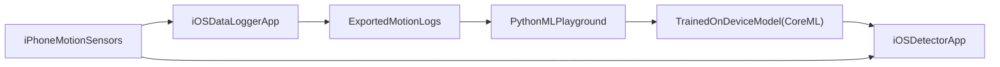

# bike.ml

## Philosophy

`bike.ml` is a fully on-device, privacy-preserving biking detector for iOS.  
The goal is to extend the usefulness of the iPhone Health app to biking while remaining:

- Lightweight: Minimal resource usage, simple UI, small model.
- Private: Data is stored locally on your device; nothing is uploaded anywhere.
- Secure: No third-party analytics, ads, or tracking.
- Unmonetized: No subscriptions, ads, or sale of data.

This is a personal project, not commercial endeavor. 

## Project overview

The project has three main components:

1. iOS data logger  
   A Swift/SwiftUI app that records motion data (accelerometer, gyroscope, etc.) and allows the user to label it biking vs. not biking. This app stores logs locally and can export them via standard iOS sharing mechanisms (e.g., Files, AirDrop).
2. ML playground  
   A Python-based environment for ingesting exported logs, cleaning data, engineering features, training models, and benchmarking their performance.
3. On-device detector  
   An updated version of the iOS app that bundles one (or more) trained models and performs live, on-device biking detection using the same motion signals.

## High-level architecture

- iOS data logger: Minimal Swift/SwiftUI app (no networking) that uses `CoreMotion` (and optionally `CoreLocation`) to log timestamped motion streams with user-provided labels.
- ML playground: Python environment (Jupyter + scripts) for ingesting logs, cleaning data, engineering features, training multiple models, and exporting Core ML artifacts.
- On-device detector: Updated iOS app that bundles the chosen model(s), performs windowed inference on live motion streams, and surfaces whether you are currently biking—still fully offline.

## Repo structure

Planned repository layout:

- Root
  - `README.md`: Project overview, philosophy, phases, and quickstart for iOS + ML.
  - `LICENSE`: License for the project.
- `ios/`
  - Swift/SwiftUI source for the app.
  - Phase 1: `BikeLogger` target focused solely on data collection and export.
  - Phase 3: `BikeDetector` module or additions for live on-device inference.
- `ml/`
  - Python ML playground.
  - `requirements.txt` or `pyproject.toml` for dependencies.
  - `notebooks/` for exploration.
  - `scripts/` for repeatable pipelines (ingestion, feature extraction, training, export).
- `data/`
  - Local (gitignored) folder where exported motion logs are stored for analysis.
- `models/`
  - Versioned exported models (e.g., `.mlmodel`) and training metadata.

As the project is implemented, these directories will be created and documented.

## Phases

### Phase 1: iOS data logger for training data

Objective: Collect high-quality, labeled motion data to train a biking detector, with zero backend.

- Technology choices
  - Swift + SwiftUI, targeting a modern iOS version (e.g., iOS 17+).
  - `CoreMotion` (`CMMotionManager` / `CMDeviceMotion`) for accelerometer + gyro.
  - Optional: `CoreLocation` (`CLLocationManager`) for speed or coarse location-derived features (speed only, no raw coordinates if desired).

- Core features
  - Session control: Simple UI with “Start recording” / “Stop recording” and a current session label (e.g., *Biking*, *Not biking*, *Unknown*).
  - Labeling:
    - At minimum, record whether the session is intended to be *biking* or *non-biking*.
    - Optionally, allow mid-session label changes (e.g., walk → bike → stop) for finer temporal resolution.
  - Data schema (per-sample or per-window, captured on-device):
    - Timestamp.
    - Accelerometer (x, y, z).
    - Gyroscope (x, y, z).
    - Possibly derived device motion (attitude, rotation rate, user acceleration).
    - Optional: speed (if using `CoreLocation`).
    - Label (biking / non-biking / unknown).
    - Session id and device metadata (model, OS version) for later analysis.
  - Storage:
    - Append samples to local files in the app’s `Documents/` directory (e.g., newline-delimited JSON, CSV, or a lightweight binary format).
    - Organize by session (`session_<timestamp>.jsonl`), with a small manifest file describing session-level metadata.
  - Export:
    - Use the iOS share sheet to export selected sessions (e.g., as zipped files) to Files, AirDrop, or email.
    - No network calls inside the app other than OS-provided export channels.

- Privacy & UX constraints
  - No analytics, ads, or 3rd-party SDKs.
  - Explicit statement in the app and this README that all data remains on-device until manually exported.
  - Optional toggle to never record location-based fields at all.

### Phase 2: ML playground for cleaning, training, and benchmarking

Objective: Use exported motion logs to build and compare multiple classifiers for “biking vs. not biking”, optimized for accuracy and on-device efficiency.

- Environment setup (in `ml/`)
  - Python 3.x with:
    - `numpy`, `pandas`, `scikit-learn`.
    - `matplotlib` and/or `seaborn` for visualization.
    - `jupyter` for exploratory work.
  - For more advanced models:
    - `torch` or `tensorflow` for deep learning.
    - `coremltools` for conversion to Core ML.

- Data ingestion & cleaning
  - Scripts and/or notebooks to:
    - Load exported session files from the `data/` directory.
    - Validate schema, handle missing or corrupted samples.
    - Resample to a consistent frequency and align sensors if needed.
    - Balance classes and mark intervals where the label is ambiguous.

- Feature engineering
  - Windowed time-series features (e.g., 1–5 second windows with overlap):
    - Per-axis means, variances, max/min, energy, signal magnitude area.
    - Frequency-domain features (FFT amplitudes in selected bands) if beneficial.
    - Horizontal vs. vertical acceleration patterns, jerk, etc.
  - Support toggling features and saving feature-config metadata alongside trained models.

- Model training & benchmarking
  - Baseline models:
    - Logistic regression / linear classifier.
    - Random forest or gradient boosting.
  - Potential advanced models:
    - Small fully-connected neural nets or 1D CNNs on raw or lightly processed windows.
  - For each model:
    - Train/validation/test split that respects session boundaries (no leakage across splits).
    - Evaluate accuracy, precision/recall, false positives, and temporal stability (how noisy predictions are over time).
    - Log model size and per-window inference cost estimates.
  - Select 1–2 candidate models that provide a good accuracy vs. complexity tradeoff for on-device use.

- Export for deployment
  - Convert chosen model(s) to Core ML (`.mlmodel`) using `coremltools`.
  - Save artifacts in the `models/` directory along with a small JSON/YAML description of:
    - Required input features, window size, sampling rate.
    - Versioning info (model name, date, git commit).

### Phase 3: On-device model integration & live detection

Objective: Integrate the trained model into the iOS app for real-time biking detection, keeping the app offline and efficient.

- App architecture
  - Introduce a `DetectionEngine` module in the iOS code that:
    - Maintains a sliding window buffer of recent sensor samples.
    - Computes the same features used during training.
    - Calls the bundled Core ML model for classification.
    - Applies temporal smoothing (e.g., majority vote over the last N predictions) to reduce flicker.

- Runtime behavior
  - Run detection only when explicitly enabled (e.g., “Start detection” button) to control battery usage.
  - Display current state (Biking / Not biking / Uncertain) and optionally simple counters (e.g., time spent biking today).
  - Optionally log predictions + true labels with user feedback to improve future models.

- Model management
  - Bundle a default model in the app.
  - For this personal project, model updates can be done via Xcode builds (no in-app update mechanism is required).

- Testing & validation
  - Unit tests for feature computation to match Python reference implementations.
  - Sanity-check predictions on predefined test sessions (replaying recorded data through the on-device engine).

## Data and privacy

- All motion data is stored locally on-device in the app’s sandbox.
- Exporting data is a manual operation (e.g., via Files or AirDrop); there is no automatic upload.
- There is no analytics, crash reporting, or advertising SDK included in the app code.
- Location data, if used, can be configured to:
  - Be disabled entirely.
  - Capture only derived quantities like speed, never raw coordinates.

## Getting started (high level)

This section will become more detailed as the code is implemented, but the high-level flow is:

1. iOS logger
   - Open the Xcode project in the `ios/` directory (once created).
   - Build and run the `BikeLogger` target on an iPhone.
   - Record labeled sessions (biking vs. non-biking).
   - Export session files via the share sheet and place them in the `data/` directory of this repo.
2. ML playground
   - Create and activate a Python virtual environment.
   - Install dependencies listed in `ml/requirements.txt` (once created).
   - Use the scripts or notebooks in `ml/` to ingest data, explore, and train models.
   - Export a Core ML `.mlmodel` file into the `models/` directory.
3. On-device detection
   - Add the generated `.mlmodel` into the Xcode project.
   - Build and run the updated app that uses the `DetectionEngine` for live biking detection.

## Status

This repository currently contains documentation and will be extended with:

- An initial iOS logger implementation under `ios/`.
- A Python ML playground under `ml/`.
- A documented data schema and example logs under `data/`.
- Exported models and metadata under `models/`.

Implementation will follow the phased plan described above.

## Planning

Final deployed state
- binary classifier
- wrapped in business logic 
  - e.g. $N$ consecutive positive predictions $\rightarrow$ we are biking, start collecting GPS, deriving speed, etc.

Training model
- minimal inputs, just accel/gyro. 